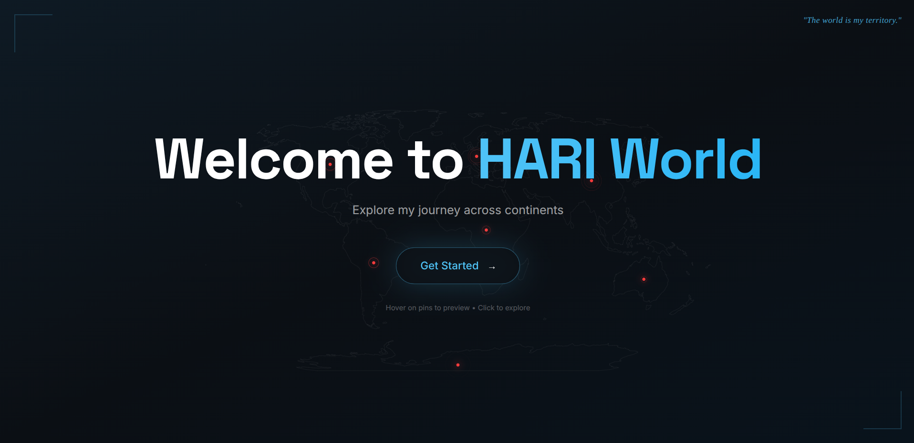
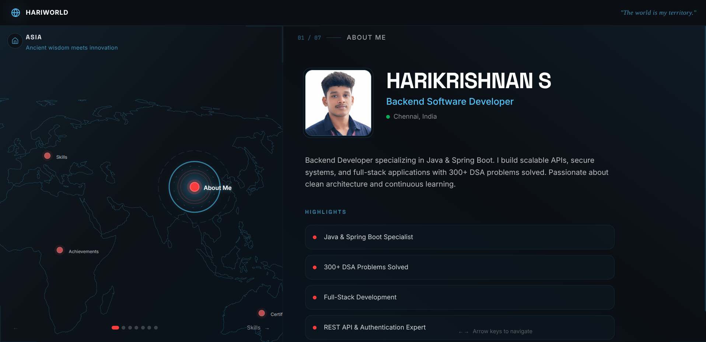
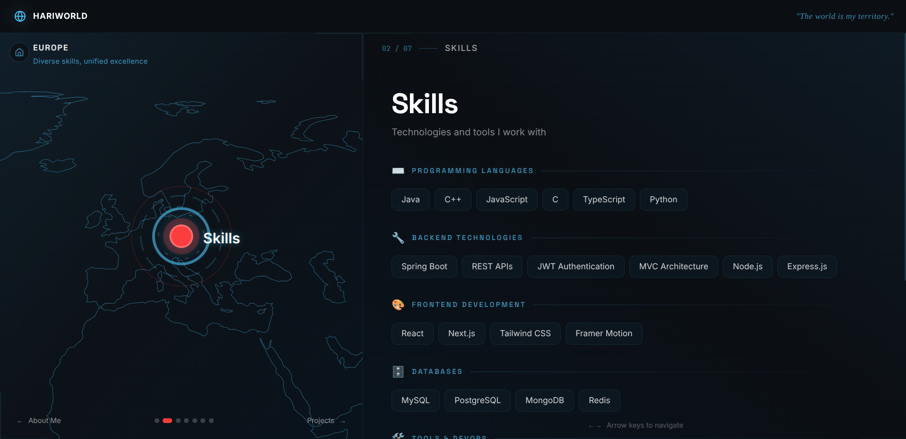
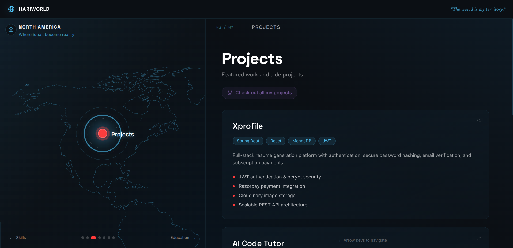
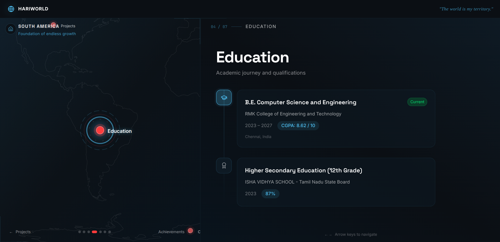
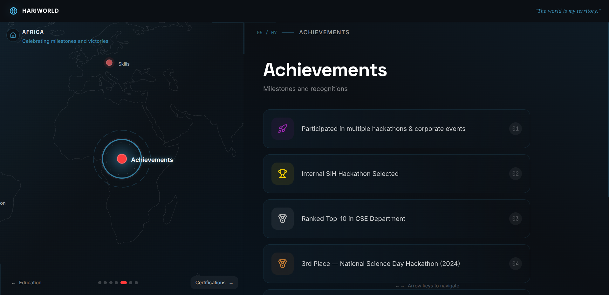
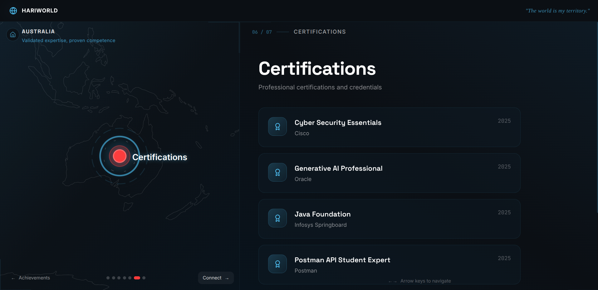

# 🌍 HARI World

> *"The world is my territory."*

A cinematic, map-based interactive portfolio where users explore my journey across continents. Navigate through different sections by clicking on continents — a unique storytelling experience.



---

## ✨ Features

- 🗺️ **Interactive World Map Navigation** — Click on continents to explore different sections
- 🎬 **Cinematic Animations** — Smooth transitions powered by Framer Motion
- 🌙 **Dark Theme** — Eye-friendly design with a professional aesthetic
- 📱 **Fully Responsive** — Works seamlessly on desktop, tablet, and mobile
- ⚡ **Fast & Optimized** — Built with Next.js 16 and Turbopack
- 🎯 **Keyboard Navigation** — Use arrow keys to navigate sections

---

## 🖼️ Screenshots

### Landing Page


### About Section


### Skills Section


### Projects Section


### Education Section


### Achievements Section


### Connect Section


---

## 🛠️ Tech Stack

| Category | Technologies |
|----------|-------------|
| **Framework** | Next.js 16, React 19 |
| **Language** | TypeScript |
| **Styling** | Tailwind CSS 4 |
| **Animations** | Framer Motion |
| **State** | Zustand |
| **Maps** | React Simple Maps |
| **Analytics** | Vercel Analytics |

---

## 🚀 Getting Started

### Prerequisites
- Node.js 18+
- npm or pnpm

### Installation

```bash
# Clone the repository
git clone https://github.com/officialhari/hariworld-portfolio.git

# Navigate to project
cd hariworld-portfolio

# Install dependencies
npm install --legacy-peer-deps

# Start development server
npm run dev
```

Open [http://localhost:3000](http://localhost:3000) to view it in your browser.

### Build for Production

```bash
npm run build
npm start
```

---

## 📁 Project Structure

```
├── app/                    # Next.js App Router
│   ├── globals.css        # Global styles & theme
│   ├── layout.tsx         # Root layout
│   └── page.tsx           # Main entry point
├── components/
│   ├── landing/           # Landing page component
│   ├── layout/            # App shell, panels, header
│   ├── map/               # Interactive world map
│   └── sections/          # About, Skills, Projects, etc.
├── lib/                   # Utilities & constants
├── store/                 # Zustand navigation store
└── public/                # Static assets
```

---

## 🎨 Sections

| Continent | Section | Description |
|-----------|---------|-------------|
| 🌏 Asia | About | Personal introduction & highlights |
| 🌍 Europe | Skills | Technical skills & tools |
| 🌎 North America | Projects | Featured work & side projects |
| 🌎 South America | Education | Academic journey |
| 🌍 Africa | Achievements | Milestones & recognitions |
| 🌏 Australia | Certifications | Professional certifications |
| 🧊 Antarctica | Connect | Contact information & socials |

---

## 👨‍💻 Author

**Harikrishnan S**

- 🔗 LinkedIn: [linkedin.com/in/harikrishnan2006](https://www.linkedin.com/in/harikrishnan2006/)
- 🐙 GitHub: [github.com/officialhari](https://github.com/officialhari)
- 📧 Email: harikrishnan777h@gmail.com

---

## 📄 License

This project is open source and available under the [MIT License](LICENSE).

---

<p align="center">
  Made with ❤️ by Harikrishnan S
</p>